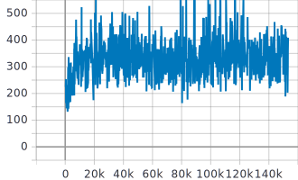
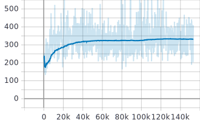
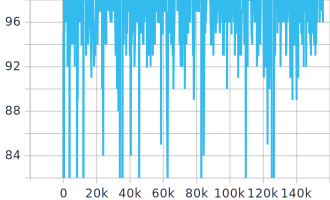
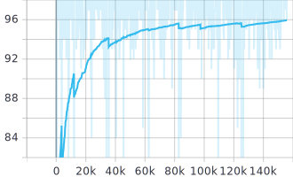

# pokemonBot

Explore reinforcement learning by training pokemon bots for Pokemon Blue/Red.

Table of contents
=================

- [pokemonBot](#pokemonbot)
    + [Introduction](#introduction)
- [OutOfMyRoom](#outofmyroom)
  * [Approach](#approach)
  * [Training](#training)
  * [Play](#play)
    + [Requirements:](#requirements-)
    + [Setup:](#setup-)
    + [How it works](#how-it-works)
- [Battle](#battle)
  * [Approach](#approach-1)
    + [Training](#training-1)
    + [Loss](#loss)
    + [Reward](#reward)
    + [Evaluation](#evaluation)
- [Todo List](#todo-list)

### Introduction

So far only Q learning NN have been tested.
Note that the network is not a multilayer convolutional network,
as I am using the states as input values for the NN, not images from the game.

Code has been edited from:

* https://pythonprogramming.net/training-deep-q-learning-dqn-reinforcement-learning-python-tutorial/?completed=/deep-q-learning-dqn-reinforcement-learning-python-tutorial/
* https://github.com/tylerwmarrs/pokemon-battle-simulation

OutOfMyRoom
============

As a novel to reinforcement learning, I have tested a Q learning Neural Network
on a simple task: get out of the first room of the game.

In order to train the network, I have simulated the room through the BlobEnv class.

However, it is possible to test a model snapshot on the VBA emulator through the `play.py` script.
As the script relies on an AHK script, please see the play(#play) section before running the script.

## Approach

All of this is defined in the `DQNAgentSimulation.py` script, within the `BlobEnv` class.

* State features: Coordinates (x,y) of the player.

* Actions: move up, move down, move left, move right.

* Final states:  
    * Coordinates of the tile of the game containing the stairs to get out of the room. Als
    * Coordinates of tiles that block the player (e.g. walls, plans, pc, table...)

* Reward definition:
    * Whenever the agent moves on a tile that does not block him, but that is not the of the exit, `reward -= 1`.
      This will penalise routes to the exit that are not minimal.
    * Whenever the agent moves on a tile that blocks him `reward -= 100`.
    * Whenever the agent reaches the exit, `reward += 100`. 
    
## Training

Training is pretty straightforward with regard to Q-learning and is implemented in the scripts `train_simulation.py` and `DQNAgent/DQNAgentSimulation.py`
If you are new to Q-learning, I suggest you this article: https://towardsdatascience.com/qrash-course-deep-q-networks-from-the-ground-up-1bbda41d3677
Moreover, you can find an explanation of most of the code I am using here: https://pythonprogramming.net/deep-q-learning-dqn-reinforcement-learning-python-tutorial/

## Play

### Requirements:

* VBA emulator:
    * Memory viewer must be present among the tools.
    * Player needs to be in the first room of the game, after having spoken to Prof. Oak.
    
### Setup:

You will have to open the Memory Viewer once and save in the "states" folder whatever value.
This will make the Memory Viewer remember the last folder used and run the ahk scripts flawlessy.
If you want to try with a ready-to-go trained model, there is one in `models_saved` folder.
    
### How it works

The `play.py` relies on the `DQNAgent` class uses a combination of AHK scripts to read values from the memory viewer (e.g. the coordinates of the player) and
save them to files that can be read from the agent. Moreover, an AHK script is used for moving the player. The action
decided by the model is added dynamically when running the AHK script from python.
You can press ESC anytime in order to stop the script.

The values of the position of the player in the memory can be easily located on specific addresses, as explained here:
https://datacrystal.romhacking.net/wiki/Pok%C3%A9mon_Red/Blue:RAM_map

Battle
============

The next task I have defined for the agent was to win a 1v1 pokemon battle.

## Approach

In order to make the simulation code simpler I have not considered ailments (sleep, poison, etc.).
Some moves that have side effects do not have such side effects (e.g. explosion does not kill the pokemon atm)
The battles are generated randomly, meaning that some would not be possible to be won by the agent.
The `BlobEnv` class generates battles with different levels.
EV and IV values have been hardcoded by now.

* State features: 
    * Types of the current pokemon
    * Type, power, pp of each move the pokemon has.
    * Opponent's HP.
    * Opponent's type.

* Actions: Use move 1, Use move 2, Use move 3, Use move 4

* Final states:  
    * Winning a battle.
    * Using an empty slot where a move does not exist.
    * Losing a battle (when not training against a dummy, see below)

* Reward definition:
    * Whenever the agent wins a battle, `reward += 100`.
    * Whenever the agent loses a battle (if not against a dammy, see below), `reward -= 100`
    * Whenever the agent uses an empty slot as a move, `reward -= 100`.
    * Whenever the agent damages the opponent without winning or losing the fight, I have tried two different approaches:
        * `reward -= 100`
        * Have the reward proportional to the damage inflicted. This usually makes Q values way harder to learn for the network.
    
The code for the simulated environment is an edited version of the one in this repo: https://github.com/tylerwmarrs/pokemon-battle-simulation

### Training

I have been trying two different ways of training the agent.
One trains the agent in real battles, where the agent can either win or lose.
Unfortunately, as battles are generated randomly, training might get stuck as some battles cannot be won.
The Win rate achieved through with this method never went past 47% on evaluation set, which still might include battles that cannot be won by the agent.
The python scripts for this training are `DQNAgent_battle.py` and `train_pokemon_battle`.

In order to start with something simple, I preferred to train the agent with a dummy, defining the task as "Find the
shortest combination to move that makes you win". Battles where no moves can make any damage to the opponent are filtered
at generation time. After a certain amount of times (`MAX_SAME_BATTLE` constant) a new battle is loaded. 

This method gave 58% as win rate on evaluation set, which still might include battles that cannot be won by the agent.
Often the agent takes different decisions depending on the order the moves are in the slots, which makes it still not very consistent.

I am posting below tensorboard values of different metrics (X axis is the number of steps). Second of each graph is the smoothed version of the same:

### Loss

### Reward

### Evaluation

In order to evaluate the agent, use the `evaluate_battle.py script`. You can also test the agent against custom battles
through the notebook `Test Battle.ipynb`. I have saved the model with 58% win rate in the `models_saved` folder if you'd like
to try it.

# Todo List

- [ ] Explore policy gradient technique. 
- [ ] Improve battle generation mechanism.
- [ ] Extend battle simulation with ailments and modifiers.
- [ ] Once 1v1 encounters are done, train with battles between trainers.
- [ ] Make models compete with each other.
- [ ] Plug battle to VBA emulator.